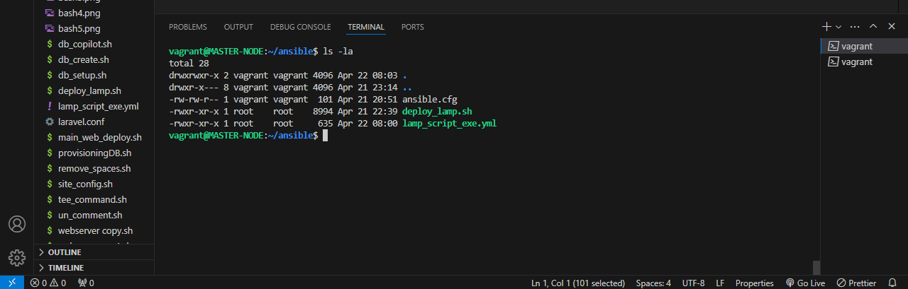

# AltSchool Cloud Engineering Examination Project
#### <span style="color:magenta">(Deploy LAMP Stack)</span>
#### <span style="color:magenta">Objective</span>
Automate the provisioning of two Ubuntu-based servers, named “Master” and “Slave”, using Vagrant.

On the Master node, create a bash script to automate the deployment of a LAMP (Linux, Apache, MySQL, PHP) stack.
This script should clone a PHP application from GitHub, install all necessary packages, and configure Apache web server and MySQL. 
Ensure the bash script is reusable and readable.

Using an Ansible playbook:
1. Execute the bash script on the Slave node and verify that the PHP application is accessible through the VM’s IP address (take screenshot of this as evidence)
2. Create a cron job to check the server’s uptime every 12 am.

Requirements

Submit the bash script and Ansible playbook to (publicly accessible) GitHub repository.

Document the steps with screenshots in md files, including proof of the application’s accessibility (screenshots taken where necessary)

Use either the VM’s IP address or a domain name as the URL.
PHP Laravel GitHub Repository: https://github.com/laravel/laravel


## <span style="color:magenta">SOLUTION</span>
#### <span style="color:magenta">Preamble...</span>
The following are pre-requisite to below steps outline for the actualization of the objective set by this exam project.
1. Bare metal; PC with Host OS (Windows in my case; windows 10 precisesly)
2. Hypervisor; a virtualization software to create the virtual machine. In my case, Oracle Virtual box (for windows) is hypervisor of choice. 
3. Command Line Terminal (both powershell and Gitbash were used for this task). 
These had already been setup through the course of the semester in AltSchool Cloud engineering program that I have been part of for the best part of 8 months

#### <span style="color:magenta">Step 1; Creating Virtual Machines</span>
To conform with the instruction to automate the Virtual Machines (VMs) creation, I created a multi-VM environment on vagrant using the code on Vagrantfile show below. For simplity, the steps acquire and install the above pre-requisites aren't detailed here. However, note that those are very vital to the rest of the steps.

The multi-vm Vagrantfile creates two VMs, a "MASTER-NODE" and a "SLAVE-NODE". The master node has a shared folder synced, to seamlessly move files between my host PC and VM.


Notice that the VMs are defined and named for identication and convinience. This is power of vagrant.
Also noteworthy is the port forwarding and IP assignment automation made possible by vagrantfile. I used both features for the two VMs.

This 2-VM enivronment appears on the hypervisor (virtualbox) as seen below...


These two VMs are provisioned with ubuntu as the linux distro of choice. which adheres to the instructions to deploy LAMP (Linux Apache MySQL PHP), and to use the Debian family of Linux,
using the following commands....
```bash
vagrant up master
```
for the master node and, 
```bash
vagrant up slave
```
for the slave node.


#### <span style="color:magenta">Step 2; Logging into both VMs. </span>

After creating the VMs, the following commands were used to log in and access the VMs with SSH protocol (vagrant has abstracted this process for us; one of the beauties of vagrant).

To log into the master, 
```bash
vagrant ssh master
```
and for the slave,
```bash
vagrant ssh slave
```
Upon login, one is greeted with the below screen..


The VM created with vagrant has a user in the sudoer group called vagrant. This user is adequate for the task ahead, so there was no need to create another. 

The vagrant user will therefore be used throughout this project.

#### <span style="color:magenta">Step 3; Installing ansible in the "Master Node".</span>
The master node can also can also be called the controller node as it's just another node or server used to control other nodes (or server) which could range from one to thousands.
Ansible being a configuration management software which needs no agent to communicate to the managed nodes is required to be installed on just the master. 

So, I installed ansible using the following commands.
```bash
sudo apt update
```
to firstly update existing package repositories.
then, 
```bash
sudo apt-add-repository ppa:ansible/ansible
```
to add package repository for ansible so that latest version of ansible can be installed even when not yet added officially by ubuntu
then,
```bash
sudo apt install ansible
```
After installation, I ran the following command ensure that the installation was successful and also note the version of ansible installed...
```bash
ansible --version
```
which produced result below....


#### <span style="color:magenta">Step 4. Creating a bash script on the "Master Node".</span>
Using VScode, I created the file "deploy_lamp.sh" in the shared folder earlier synched (via Vagrantfile) and developed it with the commands and conditionals adequate to execute the set objective of deploying a LAMP server. 

In a bid to make the code as reusable and readable as possible, I used functions to accomplish most of the the tasks.
The script was created in the following directory, which is in the shared folder earlier synced. 
```bash
/vagrant_data/exam_project
```
The script was made executable using the following command.
```bash
    sudo chmod +x /vagrant_data/exam_project/deploy_lamp.sh
```
Then it was tested on the master node using the following commands....
```bash
   cd /vagrant_data/exam_project
```
then
```bash
    ./deploy_lamp.sh
```
This was repeated as many times as was required, editing the code until I was certain that the set objective of the script had been met, which is to automatically host the laravel.

View the final script [here](./deploy_lamp.sh)

#### <span style="color:magenta"> Step 5; Setting up Ansible Environment </span>
The host file at /etc/amsible/hosts was updated to include the slave-node, identified by it's IP and placed in a group called [web-servers]. Connent of the hosts file as below...
##
        [web-servers]
        server1 ansible_host=192.168.56.11

        [all:vars]
        ansible_python_interpreter=/usr/bin/python3
The last line makes sure that python3 is used to run our playbook. not python 2.7.

Then created ansible directory in home directory to as repository for the task ahead.

```bash
cd ~
mkdir ansible
```
Then I created the local config file to be used just for this specific task.
```bash
nano ansible.cfg
```
I populated this file with the following config strings and values...
##
        [defaults]
        inventory = /etc/ansible/hosts
        remote_user: vagrant
        private_key_file = ~/.ssh/ansible_key

which tells ansible to look into this config file for default configurations for all tasks and playbooks run while in this ansible directory, instead of the global ansible.cfg in /etc/ansible/

This file tells ansible where to load host inventory from, aside the global loacation in /etc/ansible/ the host inventory can be located anywhere, but have to be specified in the ansible.cfg file else, ansilbe looks assumes it's in the global version of host inventory.

Also, the user on the remote server to login with as well as the ssh key (yes, ansible uses ssh for aunthentication) are also specified here.


#### <span style="color:magenta"> Step 6; Preparing Ansible  playbook and finalizing the local environment for deployment.</span>
In the next step, I resorted to VScode again for the writing of the playbook in yaml format. This was vital to help with the syntax-strictness of yaml. The playbook is named "lamp_script_exe.yml"

In the playbook I wrote tasks to
1. copy the bash script from the local directory to the remote server's PATH (usr/local/bin), using ansible copy module
2. execute the script in the remote server (SLAVE-NODE) using ansible command module.
I decided against the script module due to the stated idempotence shortfall.
3. Create cronjob as required using ansible cron module.

View the playbook [here](./lamp_script_exe.yml)

After coding the playbook, I moved the playbook to the local enviroment being prepared in ansible dir created in home dir.
while still in the ansible directory...
```bash
    sudo cp /vagrant_data/exam_project/lamp_script_exe.yml ./
```
I also moved the script earlier written and test to this local ansible directory..
```bash
    sudo cp /vagrant_data/exam_project/deploy_lamp.sh ./
```
At the end, my local environment prepared looked like the screenshot below



#### <span style="color:magenta">Step 7; Running the playbook</span>
Firstly, I performed a dry run with...
```bash
    ansible-playbook lamp_script_exe.yml --check
```
This is to check the workability of the written playbook. 

And... WE ARE A GO!


With the status report, I was satisfied and confident to run my playbook to execute this project. 

And now the moment of truth!........
```bash
    ansible-playbook lamp_script_exe.yml
```

After a while the playbook returned with a status of success, just what the doctor ordered!


#### <span style="color:magenta">Step 8; Result Confirmation</span>

Now, to confirm in my host machine browser. The real moment of truth!

For this confirmation, the ip address settings in the vagrantfile during VM provisioning during step 1 above would be put to good use.

1. Browsing the localhost (or 127.0.0.1) with the forwarded port should display our project successfully. And BOOM! Target achieved
2. Browsing with the dhcp assigned IP address also yields the same result.
The evidence of results are shown below...

3. I added the extra touch of using a custom domain name for the project; with domain "laravelexam.com". This also worked out.

To achieve the domain name resolution result above, I had the ServerName in my site config file named "/etc/apache2/sites-available/laravelexams.com.conf" and the value of the ServerName property set to "laravelexams.com" as shown below...


Also, had to set the domain name in the hosts file in my windows OS Host machine, by editing c:/windows/system32/drivers/host with elevated previlege. See the host file setting below.


That brings the laravel project to an end. 

4. To confirm that the cronjob part of the playbook ran successfully, I used the following commands...
```bash
    sudo crontab -l
```

and
```bash
    sudo crontab -e
``` 


And that's a wrap! Thanks for reading.